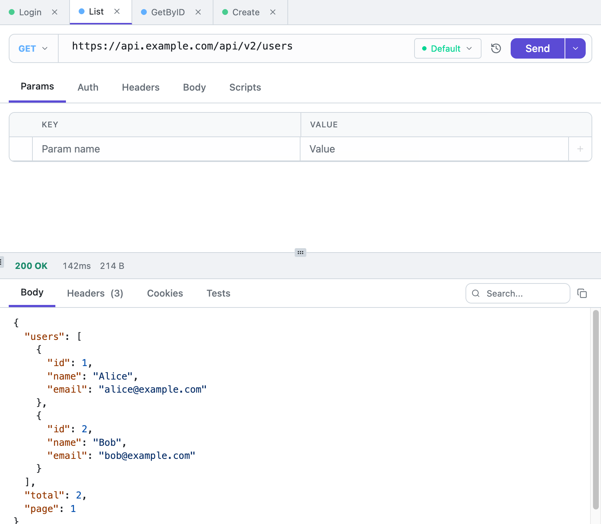

<div align="center">


# Tetiva

**A fast, local-first desktop client for HTTP, gRPC, GraphQL and WebSocket.**

~30 MB install · no account required · no telemetry · MIT

[tetiva.app](https://tetiva.app) · [Download for macOS / Windows](https://tetiva.app/download)

<picture>
  <source media="(prefers-color-scheme: dark)" srcset="docs/media/screenshot-dark.png">
  
</picture>

</div>

Collections, environments and history live in a local SQLite database, so
everything works fully offline and no account is ever required. The client only
makes the network requests you ask it to — no analytics, no telemetry, no usage
reporting. When you want the same collections on several machines or across a
team, an optional self-hosted sync server keeps them in step with realtime
updates.

It's a Wails 3 app — a Go backend with a Vue 3 frontend, no Electron — which is
how the installer stays around 30 MB. There's a live demo video and a comparison
with Postman, Insomnia, Bruno and Yaak at [tetiva.app](https://tetiva.app).

## Features

- **HTTP** — all methods, query/path params, headers, JSON/form/raw/binary
  bodies, and bearer / basic / API-key auth.
- **gRPC** — server reflection or local `.proto` files, with request and
  response inspection.
- **GraphQL** — schema browser, introspection, and a query editor with
  completion.
- **WebSocket** — raw RFC 6455 connections with a live, timestamped message log.
- **Collections** — a drag-and-drop tree; Postman v2.1 import/export, including
  auth, scripts and file fields.
- **Environments** — `{{variable}}` substitution and secret values, scoped per
  workspace.
- **History** — every request is recorded and can be replayed as a draft.
- **Scripting** — pre- and post-request JavaScript in a goja sandbox: no
  filesystem, no network, hard 5-second limit.
- **Cookies** — a persistent cookie jar per workspace.
- **Sync** *(optional)* — realtime sync through a self-hosted server, with an
  offline queue and last-write-wins conflict resolution.
- **MCP server** — exposes collections and requests to AI clients (Claude
  Desktop, Cursor) over SSE.

## Stack

**Backend:** Go 1.26, Wails 3, SQLite, Uber FX, goja.
**Frontend:** Vue 3 (`<script setup>`), TypeScript, Pinia, Tailwind CSS 4,
CodeMirror 6, reka-ui.

## Development

Run the full desktop app with hot reload (frontend + Go):

```sh
wails3 dev
```

It serves on http://localhost:9245.

You can also work on the UI on its own, in a normal browser with in-memory mock
data — no Go backend required:

```sh
cd frontend
npx vite
```

This opens http://localhost:5173. The service layer detects the browser and uses
mock services instead of the Wails bindings.

## Building

Protobuf contracts live in [tetiva-app/proto](https://github.com/tetiva-app/proto)
and are pulled in as a regular Go module dependency.

See [docs/BUILD.md](docs/BUILD.md) for the macOS build, including signing and
notarization. Per-platform tasks live under `build/`:

```sh
wails3 task build      # current platform
wails3 task package    # distributable bundle
```

## Tests

```sh
go test ./...                     # backend
cd frontend && npm test           # unit (Vitest)
cd frontend && npm run test:e2e   # end-to-end (Playwright)
```

## License

[MIT](LICENSE)
